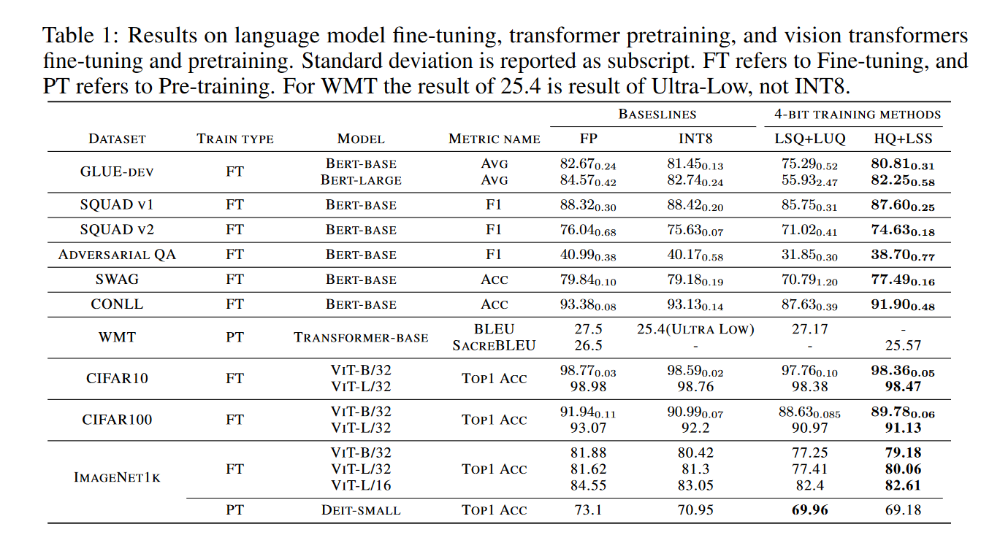

Code for HQ and LSS algorithm.

Tested with PyTorch 1.12.1 + CUDA 11.3.

Run task.sh to reproduce the result on GLUE dataset.

```
bash task.sh
```

Change --model_name_or_path bert-base-uncased to bert-large-uncased to reproduce the result for bert-large.

### Results

